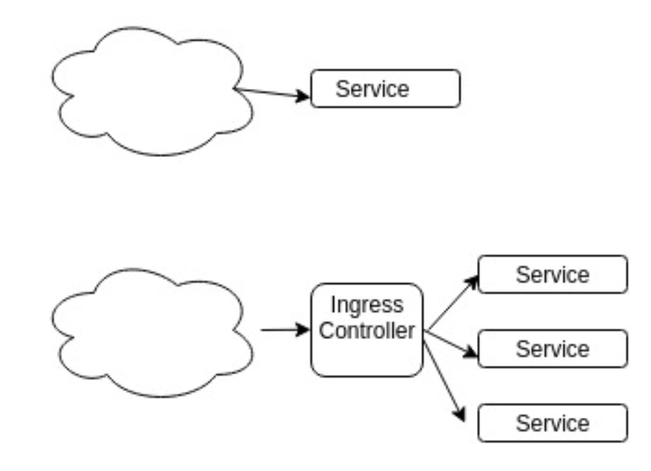

## Chapter 7: Exposing Applications

### Documentation

- kubernetes.io > Concepts > Services, Load Balancing, and Networking > [Service](https://kubernetes.io/docs/concepts/services-networking/service/)

### Generate Service

```bash
kubectl create service clusterip    app2 --tcp=80 --dry-run -o yaml
kubectl create service nodeport     app2 --tcp=80 --node-port=32000 --dry-run -o yaml
kubectl create service loadbalancer app2 --tcp=80 --dry-run -o yaml
```

Or

```bash
kubectl expose pod nginx        --port=80 [--type=ClusterIP]  --dry-run -o yaml
kubectl expose deployment nginx --port=80 --type=NodePort     --dry-run -o yaml
kubectl expose rc nginx         --port=80 --type=LoadBalancer --dry-run -o yaml
```

### Validate a Service

```bash
kubectl get services

clusterIP=$(kubectl get service app2 -o jsonpath='{$.spec.clusterIP}')
kubectl run busybox --image=busybox -it --rm --restart=Never -- sh -c "wget -q -O- http://${clusterIP}:${ServiceIP} | head -10"

curl -s http://${NodeIP}:${ServiceIP} | head -10
  
lbPort=$(kubectl get service app2 -o jsonpath='{$.spec.ports[0].nodePort}')
curl -s http://localhost${lbPort | port} | head -10
```

### Notes from the Training


From: kubernetes.io > Concepts > Services, Load Balancing, and Networking > [Service](https://kubernetes.io/docs/concepts/services-networking/service/)

Create a Service with `kubectl`

```bash
kubectl expose deployment/nginx --port=80 --type=NodePort
kubectl get services
kubectl get service nginx -o yaml
```

Get the port from `Service.spec.ports.nodePort` to open `http://<publicIP>:<nodePort>/`

#### Ingress Controllers



List of Ingress Controllers:

- Nginx
- GCE
- [Traefik](https://traefik.io/)
- [HAProxy](http://www.haproxy.org/)

### Service Mesh

- [Envoy](https://www.envoyproxy.io/)
- [Istio](https://istio.io/)
- [linkerd](https://linkerd.io/2/)


